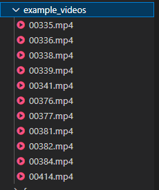

# Sign Language Recognition with ConvLSTM/LCRN

This project aims to build a word-level sign language recognition model using the WLASL dataset. It includes data preprocessing, temporal segmentation, augmentation, and model training.

---

## Table of Contents
- [Requirements](#requirements)
- [Dataset Preparation](#dataset-preparation)
- [Project Structure](#project-structure)
- [Usage](#usage)
  - [Preprocessing](#1-preprocessing)
  - [Data Augmentation](#2-data-augmentation)
  - [Training](#3-training)
- [Troubleshooting](#troubleshooting)
- [Citations](#citations)

---

## Requirements
- Python 3.8+
- Required libraries:
  ```bash
  pip install mediapipe opencv-python albumentations numpy scikit-learn matplotlib tqdm
  ```

---

## Dataset Preparation
1. **Download the WLASL Dataset**:  
   Obtain the dataset from [WLASL GitHub](https://github.com/dxli94/WLASL). Ensure you have:
   - `WLASL_v0.3.json`: Metadata file.
   - `videos/` folder: Contains videos named by `video_id` (e.g., `07502.mp4`).

2. **Organize Files**:  
   Place the files as follows:
   ```
   project_root/
   ├── videos/          # Raw videos (e.g., 07502.mp4)
   ├── wlasl_v0.3.json  # Metadata
   ├── extracted_frames/    # Preprocessed frames (auto-generated)
   └── ...
   ```

You can make an example videos folder and include these videos to start of with:
# To work with the example videos use these videos:

---

## Project Structure
```
project_root/
├── data/                   # Raw data (videos + metadata)
├── extracted_frames/       # Extracted frames (organized by label/video_id)
├── utils/
│   ├── preprocess.py       # Frame extraction + temporal segmentation
│   └── augment.py          # Data augmentation
├── models/                 # Model architectures (ConvLSTM/LCRN)
├── train.py                # Training script
└── README.md
```

---

## Usage

### 1. Preprocessing
Extract frames from videos and apply temporal segmentation using MediaPipe.

#### Step 1: Run Frame Extraction
```python
# utils/preprocess.py
import cv2
import os
import json
import mediapipe as mp

# Load metadata
with open('data/wlasl_v0.3.json', 'r') as f:
    video_to_label = json.load(f)

# Extract frames for all videos
for video_id, label in video_to_label.items():
    video_path = os.path.join('data/videos', f"{video_id}.mp4")
    output_dir = os.path.join('extracted_frames', label, video_id)
    os.makedirs(output_dir, exist_ok=True)
    
    # Use MediaPipe to detect signing intervals
    start, end = detect_signing_intervals(video_path)
    extract_frames(video_path, output_dir, start, end)
```

Run:
```bash
python utils/preprocess.py
```

### 2. Data Augmentation
Apply augmentations (flips, rotations, brightness changes) to the extracted frames.

#### Step 2: Run Augmentation
```python
# utils/augment.py
import albumentations as A

augmenter = A.Compose([
    A.HorizontalFlip(p=0.5),
    A.Rotate(limit=15, p=0.5),
    A.RandomBrightnessContrast(p=0.2),
])

# Apply to all frames
for label in os.listdir('extracted_frames'):
    for video_id in os.listdir(f'extracted_frames/{label}'):
        frames_dir = os.path.join('extracted_frames', label, video_id)
        for frame_file in os.listdir(frames_dir):
            if frame_file.endswith('.npy'):
                frame = np.load(os.path.join(frames_dir, frame_file))
                augmented = augmenter(image=frame)
                np.save(os.path.join(frames_dir, f'aug_{frame_file}'), augmented['image'])
```

Run:
```bash
python utils/augment.py
```

### 3. Training
Train a ConvLSTM/LCRN model on the preprocessed data.

#### Step 3: Train the Model
```python
# train.py
import torch
from models.convlstm import ConvLSTM

model = ConvLSTM(input_channels=3, num_classes=2000)
optimizer = torch.optim.Adam(model.parameters(), lr=1e-4)
criterion = torch.nn.CrossEntropyLoss()

# Load preprocessed frames and train
# (Implement data loading and training loop here)
```

Run:
```bash
python train.py
```

---

## Troubleshooting
- **Permission Errors**: Run scripts as administrator:  
  ```bash
  sudo python train.py  # Linux/Mac
  ```
- **Missing Frames**: Check if videos are corrupted using `ffmpeg -i video.mp4`.
- **MediaPipe Installation**: Use `pip install mediapipe --no-cache-dir`.

---

## Citations
- WLASL Dataset: [D. Li et al., 2020](https://arxiv.org/abs/2004.12355)
- MediaPipe: [Google Research](https://mediapipe.dev)
- Albumentations: [A. Buslaev et al., 2020](https://arxiv.org/abs/1809.06839)

---

## License
Your License Here (e.g., MIT).


---

### Key Features of This README:
1. **Step-by-Step Instructions**: Clear guidance for dataset prep, preprocessing, and training.
2. **Code Snippets**: Ready-to-use scripts for extraction, augmentation, and training.
3. **Troubleshooting**: Solutions to common errors (e.g., permission issues).
4. **Citations**: Proper credit to dataset and tools.

